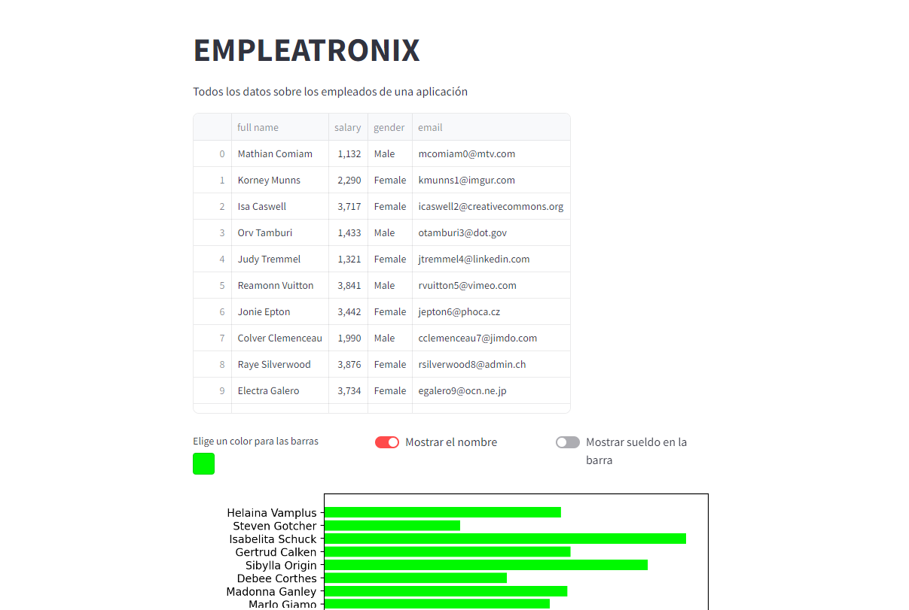

# Aplicación empleatronix
Esta es una aplicación hecha en clase que a partir de un CSV con datos de empleados, nos muesta una tabla y una gráfica.

[URL página](https://empleatronix-rkpkavkypuproyr3msxkxw.streamlit.app/)

## Contenido
En la página se muestra una tabla con todos los datos de los empleados. A continuación, se muestra una gráfica con el nombre de ellos y sus respectivos sueldos. El usuario puede:
* Elegir un color para las barras.
* Mostrar el nombre de los usuarios.
* Mostrar el sueldo exacto al lado de las barras.
